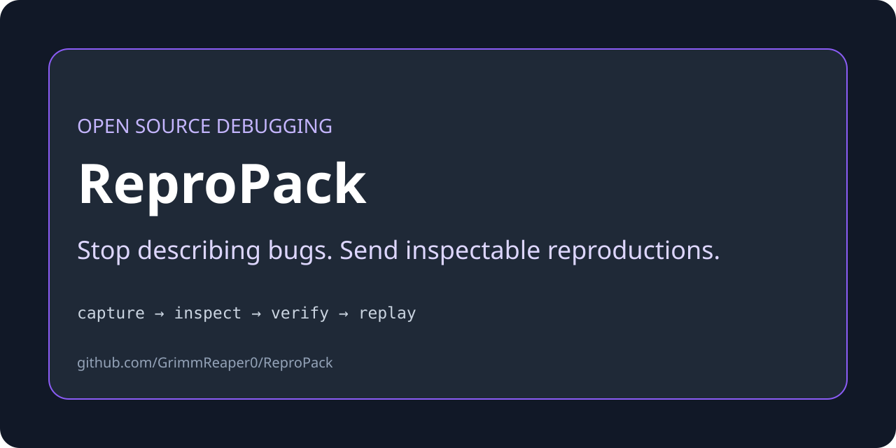

# ReproPack

**Capture an executable bug reproduction as a small, inspectable bundle.**



ReproPack is a dependency-free Python 3.11+ CLI for turning a local reproduction into portable evidence: selected project files, a declared command, bounded output, hashes, and metadata that another developer can inspect before replaying.

## Install from source

```sh
git clone https://github.com/GrimmReaper0/ReproPack.git
cd ReproPack
python3 -m venv .venv
. .venv/bin/activate
python -m pip install .
repropack --help
```

## Quick start

The repository includes an intentionally small example under `examples/bug`.

```sh
repropack --help
python -m unittest discover -s tests -v
```

Run `repropack --help` for the exact capture, inspect, verify, and replay commands supported by this release.

## Safety boundary

A reproduction bundle is evidence, not a sandbox. Inspect commands and files before replaying untrusted bundles, use a disposable environment, and do not include credentials or private data.

## Development

```sh
python -m unittest discover -s tests -v
```

Licensed under MIT where the accompanying `LICENSE` file is present. Bug reports should include a minimal sanitized reproduction and the ReproPack version.
